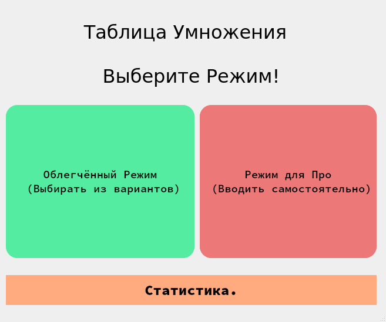
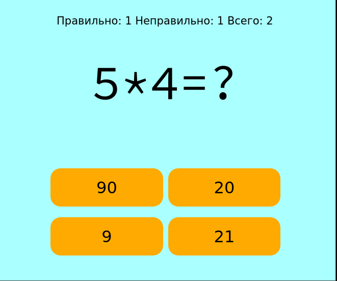
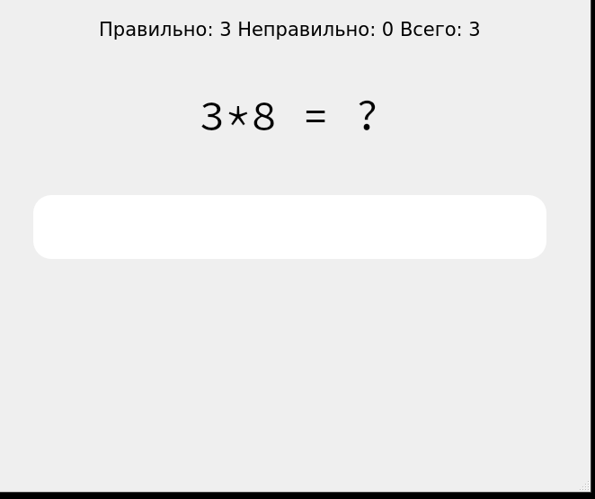
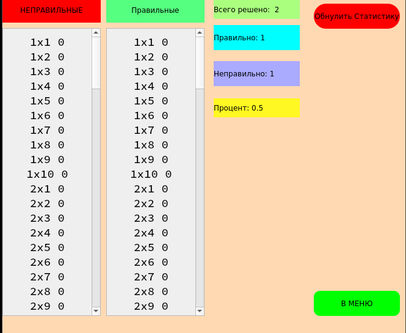

# Таблица Умножения!
Эта программа предназначена для заучивания таблицы умножения детьми,
она предоставляет минимальную статистику и программу, которая выводит 
пример и варианты(или поле для ввода в режиме про) ответов.

# Изображения






## Как запустить?
Сперва скачайте то, что указанно в requirements.txt ```pip install -r requirements.txt```.  
  
Затем введите комманду ```python main.py```  
  
У вас получилось!


## О режимах
###Облегчённый режим
Выводит пример и варианты ответов в кнопках.
  
###Режим для Про
Выводит пример и строку для ввода ответов.

###Статистика
Предоставляет табличку с правильными и неправильными ответами, которые помогают найти самые проблемные места
, так же выводит количество решённых задач, проигрышей и выйгрышей, позволяет обнулить статистику.